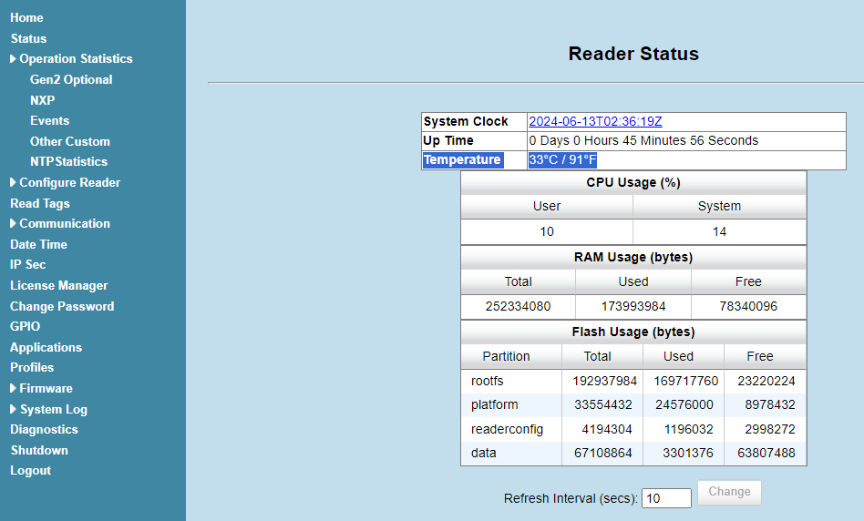

# Zebra-FX_Get_Temperature Information and Its Warning Events

#### FXシリーズ内部の温度を確認、温度アラートを検知する。

---

#### Browser Settings による確認	

1. CPU温度の確認

   "Status" > "Temprature""

   

   * **Temperature: **Display current temperature of reader in Celsius and Fahrenheit.

    
2. 温度イベント（High, Critical )発生回数の確認

   "Operation Statistics" > "Events"

   

   |                                 |                                                                              |
   | ------------------------------- | ---------------------------------------------------------------------------- |
   | AmbientTemperatureHighAlarm     | Displays the number of events raised for ambient temperature high alarm.     |
   | AmbientTemperatureCriticalAlarm | Displays the number of events raised for ambient temperature critical alarm. |
   | PATemperatureHighAlarm          | Displays the number of events raised for PA temperature high alarm.          |
   | PATemperatureCriticalAlarm      | Displays the number of events raised for PA temperature critical alarm.      |

    

   イベントは下記方法で収集が可能。

   - Browser Settings > System Log
   - /var/log/messages
   - Syslog サーバにてSystem Logを受信
   - API経由でEventを収集
