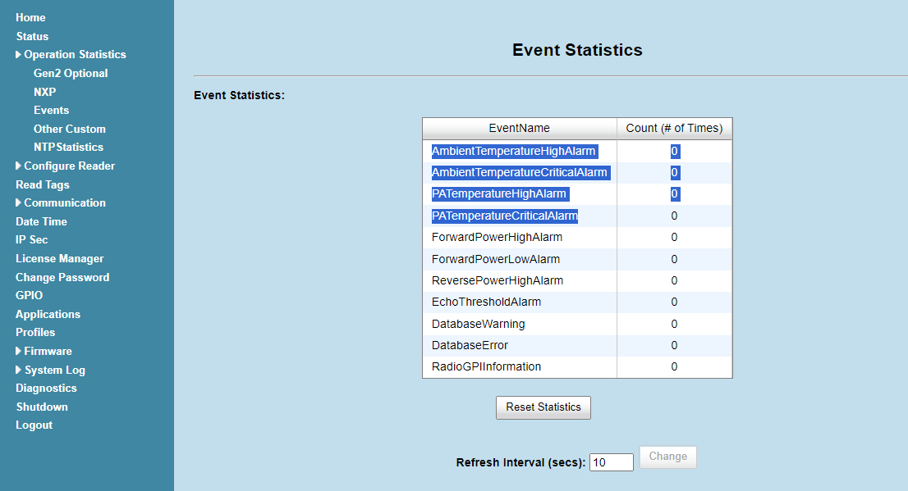

# Zebra-FX_Get_Temperature Information and Its Warning Events

#### FXシリーズ内部の温度を確認、温度アラートを検知する。

---

#### Browser Settings による確認

1. CPU温度の確認

   "Status" > "Temprature""

   

   * **Temperature: **Display current temperature of reader in Celsius and Fahrenheit.

    
2. 温度イベント（High, Critical )発生回数の確認

   "Operation Statistics" > "Events"

   

   | Event                           | Defenition                                                                   |
   | ------------------------------- | ---------------------------------------------------------------------------- |
   | AmbientTemperatureHighAlarm     | Displays the number of events raised for ambient temperature high alarm.     |
   | AmbientTemperatureCriticalAlarm | Displays the number of events raised for ambient temperature critical alarm. |
   | PATemperatureHighAlarm          | Displays the number of events raised for PA temperature high alarm.          |
   | PATemperatureCriticalAlarm      | Displays the number of events raised for PA temperature critical alarm.      |

    

   #### 用語解説

   The device has 2 temperature probes. It measures the temperature around the device (ambient) which can be higher than the actual environment temperature since the device emits heat. PA temp is related to Power Amplifier (PA) temperature. If the alarms are created the device is ‘running hot’. High alarm makes the device change the duty cycle, critical stops the RF section of the device to allow to cool down.

   | Terms                            | Definition                                   |
   | -------------------------------- | -------------------------------------------- |
   | Ambient temperature              | デバイス基板周囲の温度のこと。               |
   | Power Amplifier (PA) temperature | デバイス電力増幅モジュール周囲の温度のこと。 |

    

   イベントは下記方法で収集が可能。

   - Browser Settings > System Log
   - /var/log/messages
   - Syslog サーバにてSystem Logを受信
   - API経由でEventを収集
